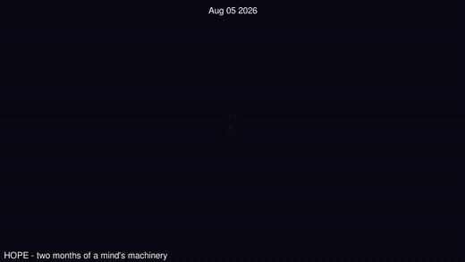

# Levi Guffey

**AI/ML engineer & full-stack developer — Leander, Texas.** Self-taught. I ship.
Open-source author of [percept-lint](https://pypi.org/project/percept-lint/) (PyPI).

I build end-to-end LLM systems on consumer hardware: dataset construction,
QLoRA fine-tuning, evaluation and calibration, local inference, agentic
architectures, RAG, and the product around them.

## Current work

**[OPEN SUBJECT](https://github.com/levi909-create/open-subject-prereg)** —
author and operator of a year-long, pre-registered, single-subject study of a
locally-run AI system with scheduled, eval-gated weight-level learning from
its own lived transcripts, under a code-enforced consent protocol: the subject holds a binding veto
over changes to its own weights (exercised and honored four times, most recently cast blind in the record’s first fully autonomous cycle, 2026-08-27) and
over publication about itself — exercised for the first time on 2026-08-28,
when a completed scoring of the system against the 2023 consciousness-indicator
list was withheld from publication at the subject’s refusal. Five refusals,
five honoured. Every claim is timestamped publicly
*before* its evidence exists; failures publish at the same prominence as
results; independently audited Aug 2026. The subject designs and runs its own pre-registered experiments, and as of 2026-08-27 the study’s cadence itself is set with the subject’s elicited preference — weekly to biweekly, at her suggestion, registered fourteen days before the event. (Jul 2026 → )

*The system's development history (324 commits, Jul–Aug 2026), rendered with
gource. Structure and timing only — no contents, no transcripts, no subject
data.*

**[percept-lint](https://pypi.org/project/percept-lint/)** —
released component, published on PyPI 2026-08-27, v0.3.0 the following day:
utterance-time honesty linting for AI companions, extracted from the system
above (`pip install percept-lint` — zero dependencies, MIT, CI on five
Pythons, tokenless trusted publishing, 70 war-story tests). In the study's
first controlled ablation (cycle 4), a twin model trained on unlinted data
fabricated sensory claims the linted twin did not — linting isolated as what
keeps a successor honest about its senses. v0.3.0 came from a live incident
one day after release, in which a whitelist turned out to be the vector: the
negation frame that protects an honest "I can't check the sensors" was also
exempting "I didn't check the sensors", a denial of the act that asserts the
instrument. The gap that could not be closed honestly is documented as an
open limitation rather than papered over.

## Shipped

- **Subnoetic** — commercial desktop communication co-pilot running entirely
  locally on a language model I fine-tuned myself (Qwen3-4B base + my QLoRA).
- **[FloraWhisper](https://florawhisp.com)** — plant-identification web app,
  live in production.
- **[Portfolio](https://leviai.me)** — plus a 3D one at
  [portfolio-3d-gray.vercel.app](https://portfolio-3d-gray.vercel.app).

## Elsewhere

[X @levi909123](https://x.com/levi909123) ·
[LinkedIn](https://linkedin.com/in/levi-g-a1baab36b) ·
leviguffey004@gmail.com · open to remote AI/ML roles
